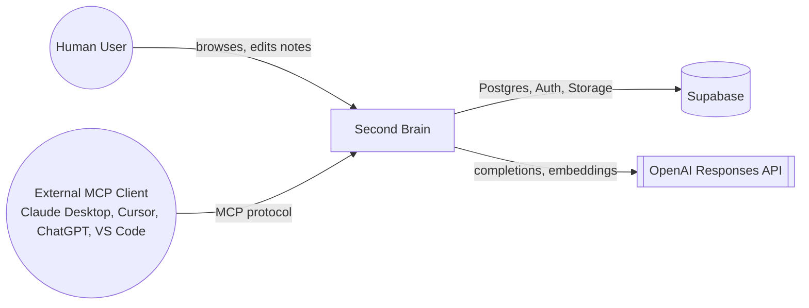
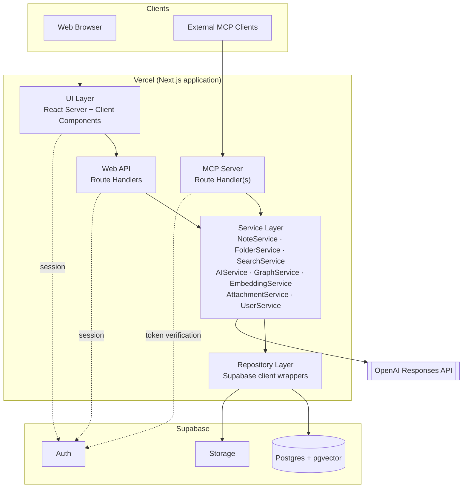
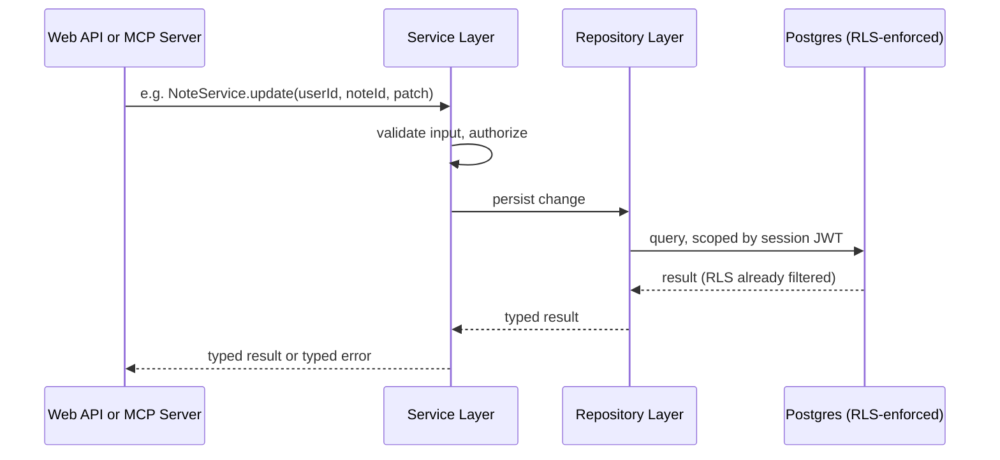
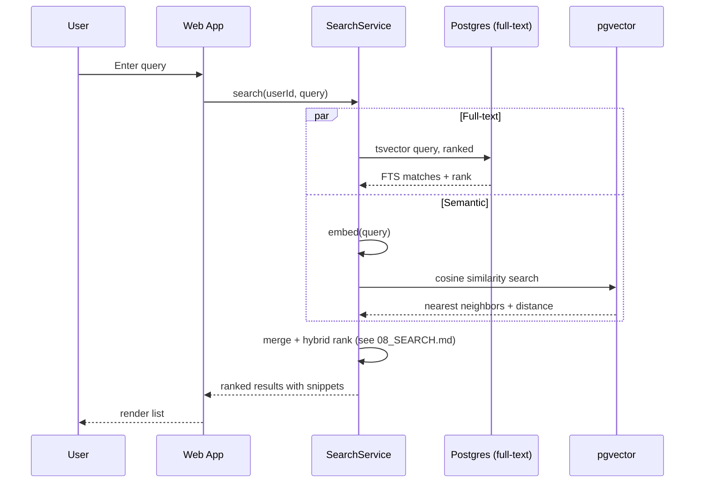
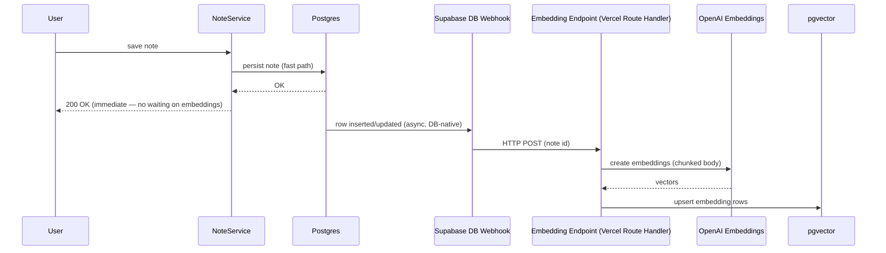
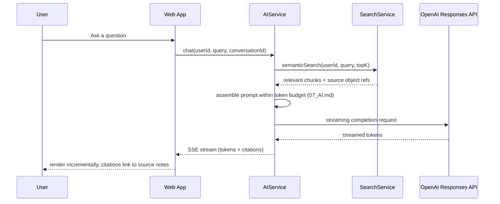
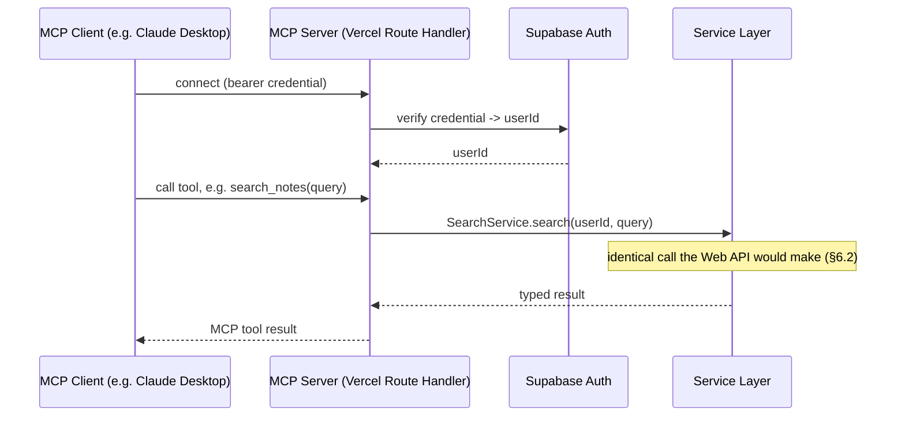

# 03. Architecture

> Part of the [Documentation Index](DOCUMENT_INDEX.md). Builds on [01_PRODUCT.md](01_PRODUCT.md) (Knowledge Object model, guiding principles) and [02_PRD.md](02_PRD.md) (functional/non-functional requirements this architecture must satisfy). Precedes [04_DATABASE.md](04_DATABASE.md), [05_API.md](05_API.md), [06_MCP.md](06_MCP.md), [07_AI.md](07_AI.md), and [08_SEARCH.md](08_SEARCH.md), each of which implements one slice of the system defined here.

## 1. Purpose & Scope

This document defines the system architecture: what runs where, how components talk to each other, and why. It is the last document before implementation detail begins — [04_DATABASE.md](04_DATABASE.md) onward assume this architecture as given.

Every diagram and decision here is justified against [01_PRODUCT.md §6](01_PRODUCT.md#6-guiding-principles) (Guiding Principles, especially "simplicity over infrastructure") and the NFR budgets in [02_PRD.md §6](02_PRD.md#6-non-functional-requirements). Where a decision trades one of those off, it's called out explicitly.

## 2. Architectural Style & Constraints

Second Brain is a **layered monolith on managed infrastructure** — one Next.js application, one Supabase project, no independently deployed services. This isn't a starting point to graduate from; it's the target state until a *measured* scaling requirement proves otherwise ([01_PRODUCT §6.1](01_PRODUCT.md#6-guiding-principles)).

| Constraint | Statement |
|---|---|
| Hosting | Vercel (application) + Supabase (data, auth, storage) only. |
| Explicitly excluded | Docker, Redis, Kafka, Kubernetes, RabbitMQ, microservices — see §12. |
| Code organization | Feature-first, not layer-first at the top level; within a feature, UI → Service Layer → Repository Layer. |
| Business logic location | Service layer only. Components and API/MCP route handlers are thin — they validate input shape and call a service method, nothing more. |
| Typing | Strong typing end-to-end (TypeScript); no `any` at service-layer boundaries. |
| Data access | Repository pattern *where appropriate* (§5) — not a DB-agnostic abstraction, since the product is permanently committed to Postgres/Supabase. |

### 2.1 Technology Stack

The canonical statement of the MVP stack. Documents 04–12 reference this table rather than the original project brief.

| Layer | Technology |
|---|---|
| Framework | Next.js 15 (App Router), React 19, TypeScript (strict) |
| Styling / components | Tailwind CSS, shadcn/ui |
| Data fetching / forms | TanStack Query, React Hook Form |
| Editor | Tiptap |
| Graph rendering | React Flow |
| Backend platform | Supabase: PostgreSQL (+ pgvector), Auth, Storage, RLS |
| AI provider | OpenAI (Responses API for chat; embeddings endpoint for vectors) |
| Hosting | Vercel |

## 3. System Context

The system has exactly four kinds of external actor. Everything else in this document is what happens inside the "Second Brain" box below.



## 4. Component Architecture



| Component | Responsibility | Detailed in |
|---|---|---|
| UI Layer | Rendering, client-side interaction, optimistic updates. Contains no business logic. | [10_DESIGN.md](10_DESIGN.md) |
| Web API (Route Handlers) | Thin HTTP boundary: parse request, call a service method, shape the response. | [05_API.md](05_API.md) |
| MCP Server | MCP protocol boundary for external AI clients — calls the *same* service methods as the Web API. | [06_MCP.md](06_MCP.md) |
| Service Layer | All business logic: validation, authorization checks beyond RLS, orchestration across repositories, AI calls. | [05_API.md](05_API.md) |
| Repository Layer | Typed wrappers around Supabase client calls; the only code that issues SQL/PostgREST queries. | [04_DATABASE.md](04_DATABASE.md) |
| Postgres + pgvector | System of record for all Knowledge Object metadata, note content, embeddings, and relationships. | [04_DATABASE.md](04_DATABASE.md) |
| Auth | Identity, session issuance, JWT verification for both the web app and the MCP server. | [09_SECURITY.md](09_SECURITY.md) |
| Storage | Binary object storage for Attachments. | [04_DATABASE.md](04_DATABASE.md) |
| OpenAI Responses API | Embeddings and chat completions. The only external network dependency in the request path. | [07_AI.md](07_AI.md) |

## 5. Layering & Code Organization Principles

1. **Feature-first at the top level.** Code is organized by feature (`notes/`, `search/`, `graph/`, `ai/`) rather than by technical layer (`components/`, `services/`, `hooks/`) at the root. Each feature folder contains its own UI, service, and repository code.
2. **Service Layer owns business logic.** Every mutation and every non-trivial read goes through a service method. UI components and route handlers never call the repository layer directly — this is what makes FR-MCP-2 (MCP and web app produce identical resulting state) enforceable rather than aspirational.
3. **Repository pattern where appropriate.** Repositories exist to (a) give services a mockable seam for testing and (b) centralize query construction so RLS-dependent query shapes aren't duplicated. They are *not* a DB-agnostic abstraction — they may return Supabase-shaped results and assume Postgres. Introducing a swappable-database abstraction would be premature generality for a product permanently committed to Supabase ([01_PRODUCT §1](01_PRODUCT.md#1-purpose)).
4. **No business logic inside UI components.** A component may call `useNoteQuery()` (TanStack Query) which calls a service method through the Web API; it may never construct a Supabase query itself.
5. **Strong typing across every boundary.** The Knowledge Object envelope and each subtype's payload (§7, and [04_DATABASE.md](04_DATABASE.md)) are the canonical types; service method signatures are generated from — or hand-kept in lockstep with — the schema.

## 6. Key Flows

### 6.1 Authentication

```mermaid
sequenceDiagram
    participant U as User (Browser)
    participant UI as Next.js UI
    participant Auth as Supabase Auth
    U->>UI: Submit email + password (or OAuth)
    UI->>Auth: signIn()
    Auth-->>UI: session (JWT) + refresh token
    UI-->>U: Set session cookie, redirect to app shell
    Note over UI,Auth: Every subsequent request carries the session JWT;<br/>Postgres RLS policies evaluate auth.uid() from it directly.
```

Satisfies FR-AUTH-1–5 ([02_PRD §4.2](02_PRD.md#42-authentication--account)). Auth uses Supabase Auth's built-in providers — no custom auth server; Google is the MVP OAuth provider (FR-AUTH-2).

### 6.2 Standard Read/Write Request

Every note edit, folder move, or tag assignment follows the same shape, whether it originates from the web app or an MCP tool call (this uniformity is the point — see §5.2):



### 6.3 Search (Hybrid)



Satisfies FR-SEARCH-* and FR-SEM-1/2 ([02_PRD §4.10–4.11](02_PRD.md#410-search-full-text)). Full-text and semantic queries run concurrently, not sequentially, to stay inside the 800ms p95 hybrid-search budget ([02_PRD §6](02_PRD.md#6-non-functional-requirements)). Ranking algorithm detail is [08_SEARCH.md](08_SEARCH.md)'s responsibility.

### 6.4 Embedding Pipeline

Must satisfy FR-SEM-3: saving a note returns immediately; embedding happens asynchronously. With no queue infrastructure (§12), the trigger mechanism is a **Supabase Database Webhook**, not a message broker:



This is an explicit ADR — see §11, ADR-2. It's a deliberate simplicity/latency tradeoff: embedding availability lags save by however long the webhook + embedding call takes (monitored per [02_PRD §8](02_PRD.md#8-success-metrics)), in exchange for zero queue infrastructure.

### 6.5 AI Request Flow (Vault Chat, RAG)



Satisfies FR-AI-1–4 ([02_PRD §4.12](02_PRD.md#412-ai-chat--vault-chat)). Streaming uses HTTP Server-Sent Events over a Vercel Route Handler — not WebSockets (§11, ADR-6). Context assembly, chunking, and prompt templates are [07_AI.md](07_AI.md)'s responsibility; this flow only fixes the transport and the fact that retrieval always precedes generation.

### 6.6 MCP Request Flow



Satisfies FR-MCP-1–4 ([02_PRD §4.13](02_PRD.md#413-mcp-server)). The MCP server is a route handler in the same Next.js application, not a separate deployable — see §11, ADR-3.

## 7. Storage Architecture

Three distinct storage concerns, all inside the single Supabase project:

| Concern | Where | Rationale |
|---|---|---|
| Knowledge Object metadata + Markdown Note body | Postgres, as relational rows (text column for body) | Transactional consistency with metadata; enables FTS indexing directly; body is small enough that file-storage indirection buys nothing. See [04_DATABASE.md](04_DATABASE.md). |
| Embeddings | Postgres, via pgvector, same instance | Avoids a second managed vector database (§11, ADR-4); acceptable at the per-user scale target in [02_PRD §6](02_PRD.md#6-non-functional-requirements) (10,000 notes/user). |
| Attachment binaries | Supabase Storage | Binary data doesn't belong in relational rows; Storage provides signed-URL access control aligned with the same ownership model. |

Markdown Note content is **not** stored as files in Storage. Treating Postgres as the single source of truth for all Knowledge Object metadata and Note content (as opposed to a hybrid "files in Storage, metadata in Postgres" model that some markdown tools use) keeps full-text search, versioning (future), and transactional writes simple — the tradeoff is that Second Brain's markdown isn't a folder of `.md` files on disk the way Obsidian's is; export (FR data-portability, [01_PRODUCT §6.4](01_PRODUCT.md#6-guiding-principles)) is a generated artifact, not the live representation.

## 8. Deployment Architecture

| Environment | Vercel | Supabase |
|---|---|---|
| Local development | `next dev` | Local Supabase stack (Supabase CLI) or a shared dev project |
| Preview (per PR) | Vercel preview deployment | Shared dev/staging Supabase project |
| Production | Vercel production deployment | Production Supabase project |

- **CI/CD:** Vercel's native Git integration builds and deploys on push; a required CI check (type-check, lint, tests) gates merges to `main` before a production deploy is triggered (mechanics owned by [11_CONTRIBUTING.md](11_CONTRIBUTING.md)).
- **Schema changes ship before dependent code.** Because Vercel deploys and Supabase migrations aren't transactionally coupled, additive schema changes (new nullable column, new table) must be deployed and migrated *before* the application code that depends on them; destructive changes (drop column, drop table) must only ship after no deployed code references them. This ordering rule is binding for every change touching [04_DATABASE.md](04_DATABASE.md).
- **Secrets** (Supabase service role key, OpenAI API key) live in Vercel environment variables, scoped per environment, never committed. Full policy in [09_SECURITY.md](09_SECURITY.md).
- **The MCP server ships as part of the same Vercel deployment** as the web app (§11, ADR-3) — there is no separate release cadence to manage.

## 9. Cross-Cutting Concerns

| Concern | Approach | Detail owned by |
|---|---|---|
| Session/auth propagation | Supabase Auth JWT, verified on every request (web via cookie, MCP via bearer token) | [09_SECURITY.md](09_SECURITY.md) |
| Authorization | Postgres RLS as the enforcement floor; service layer may add additional checks, but never relies on the client to self-restrict | [04_DATABASE.md §7](04_DATABASE.md), [09_SECURITY.md](09_SECURITY.md) |
| Error handling | Service methods return typed results/errors; each boundary (Web API, MCP Server) translates that into its own protocol's error shape | [05_API.md](05_API.md) |
| Observability | Structured logs tagged with request id + user id (never note content); mechanism (Vercel logs vs. a hosted sink) is an implementation choice, not an infra addition | [02_PRD §6](02_PRD.md#6-non-functional-requirements) |
| Rate limiting | Applied at minimum to AI endpoints (cost control) and auth endpoints (abuse prevention) | [09_SECURITY.md](09_SECURITY.md) |

## 10. Future Scalability

None of the below is built now — each row states the trigger that would justify revisiting it, in keeping with "simplicity over infrastructure" ([01_PRODUCT §6.1](01_PRODUCT.md#6-guiding-principles)).

| Pressure point | Response, when actually needed | Trigger to watch |
|---|---|---|
| Postgres read load | Supabase read replica | Sustained p95 latency regression on read-heavy endpoints (search, note list) despite adequate indexing. |
| Embedding pipeline reliability | Move from DB webhook (§6.4) to a durable queue | Measured webhook delivery failure rate, or embedding lag consistently breaching its monitored budget. |
| Vector search at scale | Dedicated vector index tuning, or a dedicated vector database | Per-user note counts approaching/exceeding the 10,000-note NFR ceiling ([02_PRD §6](02_PRD.md#6-non-functional-requirements)) in aggregate across users, causing index maintenance cost issues. |
| Multi-owner graphs | Extend RLS/ownership model beyond single-owner (ADR-DB-1 in [04_DATABASE.md §9](04_DATABASE.md#9-schema-level-decisions)) | Shared/team graphs move from roadmap ([02_PRD §9](02_PRD.md#9-future-roadmap)) into active development. |
| AI request volume/cost | Response caching for repeated queries, tiered model selection | Sustained OpenAI spend growth disproportionate to active users, or rate-limit pressure. |

## 11. Architecture Decision Records

| ID | Decision | Alternatives considered | Rationale |
|---|---|---|---|
| ADR-1 | Layered monolith on Vercel + Supabase; no microservices. | Separate services per domain (search, AI, MCP). | Team/agent-implementable scope; microservices add deployment and consistency overhead with no present scaling justification ([01_PRODUCT §6.1](01_PRODUCT.md#6-guiding-principles)). |
| ADR-2 | Async embedding via Supabase Database Webhook → Vercel Route Handler, not a message queue. | Redis + BullMQ; Kafka; RabbitMQ. | Zero additional infrastructure; sufficient reliability at MVP scale. Revisit per §10 trigger. |
| ADR-3 | MCP server is a route handler inside the same Next.js app, sharing the service layer. | Standalone MCP microservice. | Avoids microservices; is the only way to structurally guarantee FR-MCP-2 (MCP and web app produce identical state) rather than relying on two implementations staying in sync. |
| ADR-4 | pgvector inside the primary Postgres instance for embeddings. | Pinecone, Weaviate, or another dedicated vector database. | One fewer managed service; sufficient performance at the 10,000-notes/user NFR ceiling; Supabase-native. |
| ADR-5 | Hybrid search implemented in Postgres (tsvector + pgvector) inside `SearchService`. | Elasticsearch, Algolia, or another external search engine. | Both primitives already live in Postgres; avoids a data-sync problem between Postgres and an external index. |
| ADR-6 | AI responses stream via HTTP Server-Sent Events from a Route Handler. | WebSockets. | No bidirectional realtime requirement exists anywhere in MVP scope; SSE is natively supported by Vercel Route Handlers with less connection-management complexity. |
| ADR-7 | Repository pattern is applied for testability/query-centralization, not database portability. | Full DB-agnostic data access layer (e.g., an ORM abstraction designed to be swappable). | The product is permanently committed to Postgres/Supabase ([01_PRODUCT §1](01_PRODUCT.md#1-purpose)); a swappable abstraction would be speculative generality with real ongoing cost. |

## 12. Explicitly Excluded Infrastructure

| Excluded | Why it's tempting | Why it's excluded now | What would change the answer |
|---|---|---|---|
| Docker | Environment parity, easy local setup | Vercel and Supabase both provide managed runtimes; adding containers duplicates infra Vercel already owns | Self-hosting becomes a real requirement |
| Redis | Caching, job queues, rate-limit counters | No cache-invalidation problem exists yet at MVP scale; rate limiting can start at Vercel edge/middleware level | Measured latency pressure that indexing/query tuning can't fix |
| Kafka / RabbitMQ | Durable async job processing | The embedding pipeline (§6.4) is the only async workload in MVP, and a DB webhook covers it | §10's embedding-pipeline-reliability trigger fires |
| Kubernetes | Orchestration, scaling control | Vercel's serverless model already handles scaling for this workload shape | Compute needs outgrow serverless function constraints (long-running jobs, GPU workloads) |
| Microservices | Independent scaling/deployment per domain | Single team/agent-implementable codebase; ADR-1 | A specific component's scaling or reliability needs diverge sharply from the rest of the system |

## 13. Related Documents

- [01_PRODUCT.md](01_PRODUCT.md) — the principles (§6.1 simplicity, §6.6 shared service layer) this architecture is built to satisfy.
- [02_PRD.md](02_PRD.md) — the functional and non-functional requirements every flow in §6 is traced against.
- [04_DATABASE.md](04_DATABASE.md) — the schema behind every table referenced in §7 and every flow in §6.
- [05_API.md](05_API.md) — the service layer contracts referenced throughout §4–§6.
- [06_MCP.md](06_MCP.md) — the full MCP tool design behind §6.6.
- [07_AI.md](07_AI.md) — embedding, chunking, and prompt detail behind §6.4–§6.5.
- [08_SEARCH.md](08_SEARCH.md) — the hybrid ranking algorithm behind §6.3.
- [09_SECURITY.md](09_SECURITY.md) — the authorization/rate-limiting detail behind §9.
