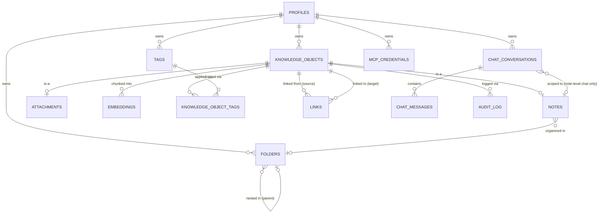

# 04. Database

> Part of the [Documentation Index](DOCUMENT_INDEX.md). Implements the storage architecture defined in [03_ARCHITECTURE.md §7](03_ARCHITECTURE.md#7-storage-architecture) and the Knowledge Object model from [01_PRODUCT.md §2](01_PRODUCT.md#2-the-knowledge-object). Precedes [05_API.md](05_API.md) (the service layer that is the *only* caller of this schema) and [08_SEARCH.md](08_SEARCH.md) (which builds ranking on top of the indexes defined here).
>
> This document describes schema structurally — tables, columns, types, relationships, indexes, constraints — as engineering specification, not as executable SQL. Actual migration files are implementation, not documentation.

## 1. Purpose & Scope

Every table below lives in the single Supabase Postgres instance ([03_ARCHITECTURE.md §7](03_ARCHITECTURE.md#7-storage-architecture)). Nothing here is optional or deferred to "later" for MVP scope — it is the complete schema needed to satisfy every functional requirement in [02_PRD.md §4](02_PRD.md#4-functional-requirements) whose priority is Must or Should.

Only two Knowledge Object subtypes exist in this schema: **Note** and **Attachment** ([01_PRODUCT §2](01_PRODUCT.md#2-the-knowledge-object), FR-KO-5). Every other row in that document's object-type table is deliberately absent from this schema — see §10.

## 2. Naming Conventions

| Rule | Convention | Example |
|---|---|---|
| Table names | Plural, `snake_case` | `knowledge_objects`, `chat_messages` |
| Column names | `snake_case` | `owner_id`, `created_at` |
| Primary key | Always `id`, type `uuid` | `id` |
| Foreign key | `<referenced_singular>_id` | `owner_id` → `profiles.id`, `folder_id` → `folders.id` |
| Timestamps | `_at` suffix, type `timestamptz` | `created_at`, `updated_at`, `deleted_at` |
| Booleans | `is_`/`has_` prefix | *(none needed in MVP schema — see notes.daily_note_date below for why a boolean was avoided)* |
| Enumerated values | `text` + `CHECK` constraint, not a Postgres `ENUM` type | `knowledge_objects.type`, `chat_messages.role` |

**Enums as `text` + `CHECK`, not `ENUM` type** — a deliberate choice (§9, ADR-DB-3): Postgres `ENUM` types require a schema migration to add a new value, which collides badly with FR-KO-5's stated intent to add new Knowledge Object types over time. A `CHECK` constraint is a one-line migration to extend.

## 3. Entity-Relationship Overview

## 4. Schema Reference

Every table below carries an `owner_id` column, even where it could be derived by joining through `knowledge_objects`. This is deliberate — see §9, ADR-DB-1.

**Delete actions (ADR-14, [DECISIONS.md](DECISIONS.md)):** every `owner_id` FK is `ON DELETE CASCADE`, and every FK referencing `knowledge_objects.id` (subtype tables, `embeddings`, `links`, `knowledge_object_tags`) is likewise `ON DELETE CASCADE`. This is what makes two documented behaviors work: the §6 hard-delete purge (which relies on envelope-row deletion cascading to children) and the FR-AUTH-6 final account deletion, which cascades `auth.users` → `profiles` → all owned rows after the grace period ([05_API.md §11](05_API.md#11-userservice)). The cascade fires only on physical row deletion — soft deletes (§6) never trigger it.

### 4.1 `profiles`

Application-specific user data, 1:1 with Supabase's `auth.users`.

| Column | Type | Nullable | Notes |
|---|---|---|---|
| `id` | `uuid` | No | PK; FK → `auth.users.id` `ON DELETE CASCADE` — deleting the auth user removes the profile |
| `display_name` | `text` | Yes | Null at signup; set via `UserService.updateProfile` ([05_API.md §11](05_API.md#11-userservice)) |
| `created_at` | `timestamptz` | No | |

**Row creation:** a trigger on `auth.users` insert creates the matching `profiles` row (`SECURITY DEFINER` — the signup context is not a user session). **RLS:** `id = auth.uid()` for `SELECT`/`UPDATE`; no user-facing `INSERT` or `DELETE` — the one documented exception to the uniform `owner_id` policy shape (§7, ADR-11).

### 4.2 `knowledge_objects`

The supertype table — the common envelope for every object in the graph ([01_PRODUCT §2](01_PRODUCT.md#2-the-knowledge-object)).

| Column | Type | Nullable | Notes |
|---|---|---|---|
| `id` | `uuid` | No | PK |
| `owner_id` | `uuid` | No | FK → `profiles.id` `ON DELETE CASCADE` (§4 intro, ADR-14) |
| `type` | `text` | No | `CHECK (type IN ('note', 'attachment'))` — see §10 for how this grows |
| `title` | `text` | No | |
| `created_at` | `timestamptz` | No | |
| `updated_at` | `timestamptz` | No | |
| `deleted_at` | `timestamptz` | Yes | Soft delete marker — see §6 |

**Indexes:** `(owner_id, deleted_at)` — every listing query filters live objects for one owner; `(owner_id, type)` — subtype-scoped listings.

### 4.3 `notes`

1:1 subtype extension of `knowledge_objects` where `type = 'note'`.

| Column | Type | Nullable | Notes |
|---|---|---|---|
| `knowledge_object_id` | `uuid` | No | PK; FK → `knowledge_objects.id` |
| `owner_id` | `uuid` | No | Denormalized (§9, ADR-DB-1) |
| `title` | `text` | No | Denormalized mirror of `knowledge_objects.title` (§9, ADR-DB-2) — enables `search_vector` below |
| `body` | `text` | No | Markdown source; default `''` |
| `folder_id` | `uuid` | Yes | FK → `folders.id` `ON DELETE SET NULL` (ADR-15) — physical folder purge moves notes to root, never deletes them; null = root |
| `daily_note_date` | `date` | Yes | Non-null only for daily notes (FR-DAILY-3: still an ordinary note row, distinguished by this column, not a separate type). A `date` rather than an `is_daily` boolean — the date itself is the datum (§2) |
| `search_vector` | `tsvector` | No | Generated from `title \|\| body`; GIN-indexed |
| `created_at` | `timestamptz` | No | |
| `updated_at` | `timestamptz` | No | |

**Constraints:** `UNIQUE (owner_id, daily_note_date) WHERE daily_note_date IS NOT NULL` — at most one daily note per date per owner (supports FR-DAILY-1's "create if absent" semantics as a safe upsert).

**Indexes:** `(owner_id, folder_id)` — folder listing; GIN on `search_vector` — FR-SEARCH-1.

**Write rule:** `NoteService` is the only writer of this table, and it always writes `notes.title` and `knowledge_objects.title` in the same transaction. No other code path may update either independently.

### 4.4 `attachments`

1:1 subtype extension of `knowledge_objects` where `type = 'attachment'`.

| Column | Type | Nullable | Notes |
|---|---|---|---|
| `knowledge_object_id` | `uuid` | No | PK; FK → `knowledge_objects.id` |
| `owner_id` | `uuid` | No | Denormalized |
| `storage_path` | `text` | No | Path within the Supabase Storage bucket (§9, ADR-DB-4) |
| `mime_type` | `text` | No | |
| `size_bytes` | `bigint` | No | Enforced against the FR-ATTACH-3 max-upload-size limit at the service layer before this row is written |
| `created_at` | `timestamptz` | No | |

### 4.5 `folders`

| Column | Type | Nullable | Notes |
|---|---|---|---|
| `id` | `uuid` | No | PK |
| `owner_id` | `uuid` | No | FK → `profiles.id` |
| `parent_folder_id` | `uuid` | Yes | FK → `folders.id` `ON DELETE SET NULL` (ADR-15) — surviving children of a purged folder become root-level; null = root-level folder |
| `name` | `text` | No | |
| `created_at` | `timestamptz` | No | |
| `updated_at` | `timestamptz` | No | |
| `deleted_at` | `timestamptz` | Yes | Soft delete — see §6 |

**Indexes:** `(owner_id, parent_folder_id)` — child listing for the folder tree UI.

**Constraint (enforced at service layer, not DB):** a folder may not be its own ancestor. Postgres has no native cycle-prevention constraint for adjacency-list trees; `FolderService.move()` checks this before write.

### 4.6 `tags`

| Column | Type | Nullable | Notes |
|---|---|---|---|
| `id` | `uuid` | No | PK |
| `owner_id` | `uuid` | No | FK → `profiles.id` |
| `name` | `text` | No | |
| `created_at` | `timestamptz` | No | |

**Constraints:** `UNIQUE (owner_id, lower(name))` — tags are case-insensitively unique per owner (supports FR-TAG-2's inline-create-if-absent semantics as a safe upsert).

### 4.7 `knowledge_object_tags`

Join table for the many-to-many between Knowledge Objects and tags (FR-TAG-1).

| Column | Type | Nullable | Notes |
|---|---|---|---|
| `knowledge_object_id` | `uuid` | No | FK → `knowledge_objects.id`; part of composite PK |
| `tag_id` | `uuid` | No | FK → `tags.id` `ON DELETE CASCADE` (ADR-16) — join rows die with the tag; part of composite PK |
| `owner_id` | `uuid` | No | Denormalized |
| `created_at` | `timestamptz` | No | |

**Indexes:** PK `(knowledge_object_id, tag_id)` covers "tags on this object"; a secondary index on `(tag_id, owner_id)` covers "objects with this tag" (FR-TAG-3).

### 4.8 `links`

Generic edges between Knowledge Objects (FR-KO-2). Wiki links (FR-LINK-1) are the only MVP source of rows here, but the table itself is type-agnostic by design.

| Column | Type | Nullable | Notes |
|---|---|---|---|
| `id` | `uuid` | No | PK |
| `owner_id` | `uuid` | No | Denormalized |
| `source_object_id` | `uuid` | No | FK → `knowledge_objects.id` |
| `target_object_id` | `uuid` | No | FK → `knowledge_objects.id` |
| `created_at` | `timestamptz` | No | |

**Constraints:** `UNIQUE (source_object_id, target_object_id)` — a link either exists or doesn't between a given pair; multiple `[[wiki links]]` to the same note within one body still resolve to a single edge (backlinks count *notes*, not occurrences).

**Indexes:** `source_object_id` — "what does this note link out to"; `target_object_id` — **critical for FR-LINK-5/6**, this is the backlinks-panel query, and it must stay index-backed as graphs grow toward the 10,000-object NFR ceiling ([02_PRD §6](02_PRD.md#6-non-functional-requirements)).

**Write rule:** rows here are derived, not directly authored — `NoteService.update()` re-parses `[[wiki links]]` out of the saved body and reconciles this table's rows (insert new, delete removed) in the same transaction as the note save, which is what makes FR-LINK-6 ("backlinks update within one page load") true without a separate reindex step.

### 4.9 `embeddings`

Chunked vector representations of Knowledge Object content, for semantic search (FR-SEM-1) and vault chat retrieval (FR-AI-2).

| Column | Type | Nullable | Notes |
|---|---|---|---|
| `id` | `uuid` | No | PK |
| `owner_id` | `uuid` | No | Denormalized |
| `knowledge_object_id` | `uuid` | No | FK → `knowledge_objects.id` |
| `chunk_index` | `integer` | No | Order within the source object |
| `chunk_text` | `text` | No | The chunk this vector represents — kept for citation/snippet display without re-fetching the source |
| `embedding` | `vector(1536)` | No | Dimension fixed at 1536, matching the small-embedding-tier decision in [07_AI.md §2](07_AI.md#2-model-selection-strategy) |
| `created_at` | `timestamptz` | No | |

**Constraints:** `UNIQUE (knowledge_object_id, chunk_index)`.

**Indexes:** an HNSW approximate-nearest-neighbor index on `embedding` (decision and rationale in [08_SEARCH.md §3](08_SEARCH.md#3-semantic-search-pgvector)). Chunking strategy itself is [07_AI.md](07_AI.md)'s responsibility; this table only fixes where chunks live.

**Write rule:** populated exclusively by the async embedding pipeline ([03_ARCHITECTURE.md §6.4](03_ARCHITECTURE.md#64-embedding-pipeline)), never synchronously on note save.

### 4.10 `chat_conversations`

| Column | Type | Nullable | Notes |
|---|---|---|---|
| `id` | `uuid` | No | PK |
| `owner_id` | `uuid` | No | FK → `profiles.id` |
| `scope` | `text` | No | `CHECK (scope IN ('note', 'vault'))` |
| `note_id` | `uuid` | Yes | FK → `knowledge_objects.id`; required when `scope = 'note'`, must be null when `scope = 'vault'` (enforced at service layer) |
| `created_at` | `timestamptz` | No | |
| `updated_at` | `timestamptz` | No | |

### 4.11 `chat_messages`

| Column | Type | Nullable | Notes |
|---|---|---|---|
| `id` | `uuid` | No | PK |
| `conversation_id` | `uuid` | No | FK → `chat_conversations.id` `ON DELETE CASCADE` (ADR-16) — messages die with the conversation |
| `owner_id` | `uuid` | No | Denormalized |
| `role` | `text` | No | `CHECK (role IN ('user', 'assistant'))` |
| `content` | `text` | No | |
| `citations` | `jsonb` | Yes | Array of `{ knowledge_object_id }` references backing FR-AI-3 |
| `created_at` | `timestamptz` | No | |

**Indexes:** `(conversation_id, created_at)` — ordered message retrieval.

### 4.12 `mcp_credentials`

Long-lived credentials issued to external MCP clients (FR-MCP-1).

| Column | Type | Nullable | Notes |
|---|---|---|---|
| `id` | `uuid` | No | PK |
| `owner_id` | `uuid` | No | FK → `profiles.id` |
| `name` | `text` | No | User-facing label, e.g. "Claude Desktop" |
| `token_hash` | `text` | No | Hash only — the raw token is shown once at creation and never stored (see [09_SECURITY.md](09_SECURITY.md)) |
| `created_at` | `timestamptz` | No | |
| `last_used_at` | `timestamptz` | Yes | Updated on each authenticated MCP request |
| `revoked_at` | `timestamptz` | Yes | Non-null disables the credential immediately |

### 4.13 `audit_log`

Minimal, append-only record of mutating actions — see §8.

| Column | Type | Nullable | Notes |
|---|---|---|---|
| `id` | `uuid` | No | PK |
| `owner_id` | `uuid` | No | FK → `profiles.id` |
| `actor` | `text` | No | `CHECK (actor IN ('user', 'ai', 'system'))` |
| `action` | `text` | No | e.g. `create`, `update`, `delete`, `ai_suggestion_applied` |
| `knowledge_object_id` | `uuid` | Yes | FK → `knowledge_objects.id` `ON DELETE SET NULL` (ADR-16 — **explicit exception to ADR-14's cascade rule**: audit history survives object purge); null for account-level actions |
| `metadata` | `jsonb` | Yes | Small, structured detail (e.g. which fields changed) — never a full content snapshot; see §8 |
| `created_at` | `timestamptz` | No | |

**Indexes:** `(owner_id, created_at)` — chronological retrieval per owner.

## 5. The Knowledge Object Supertype/Subtype Pattern

`knowledge_objects` (§4.2) holds everything common to every object type; `notes` and `attachments` (§4.3–4.4) hold everything specific to their type, joined 1:1 on `knowledge_object_id`. This is class-table inheritance, chosen over two alternatives:

| Alternative | Why not |
|---|---|
| One wide table with nullable columns per type (single-table inheritance) | `notes.body` and `attachments.storage_path` have no relationship; a single table would accumulate nullable, type-conditional columns indefinitely as [01_PRODUCT §2](01_PRODUCT.md#2-the-knowledge-object)'s future object types are added. |
| Fully separate, unrelated tables per type (no shared envelope) | Every cross-type feature — tags (§4.7), links (§4.8), search, embeddings (§4.9) — would need to union across N tables instead of joining one. This is exactly the coupling FR-KO-1/2 exist to prevent. |

**What this buys later:** adding a new Knowledge Object type (PDF, GitHub file, Jira ticket — [01_PRODUCT §2](01_PRODUCT.md#2-the-knowledge-object)) means adding one new subtype table and a new allowed value in `knowledge_objects.type`'s `CHECK` constraint. Tags, links, embeddings, and search all keep working against the new type with zero schema change, because they're written against the supertype.

## 6. Soft Deletes

`knowledge_objects.deleted_at` and `folders.deleted_at` (§4.2, §4.5) are the only soft-delete markers in the schema. Subtype and child tables (`notes`, `attachments`, `embeddings`, `links`, `knowledge_object_tags`) have **no separate `deleted_at`** — visibility is derived by joining through the parent `knowledge_objects` row, so there is exactly one place a "is this visible" check can disagree with reality.

| Rule | Detail |
|---|---|
| Default query scope | Every repository read filters `deleted_at IS NULL` unless explicitly querying trash. |
| Retention window | 30 days from `deleted_at`. |
| Hard delete | A `pg_cron`-scheduled, shared-secret-authenticated call to a service-role purge worker (ADR-18, [DECISIONS.md](DECISIONS.md)) purges expired `knowledge_objects` **and expired `folders`** (`deleted_at < now() - interval '30 days'`). Order is binding: attachment Storage binaries are deleted via the **Storage API first**, envelope rows only after (FK cascades then remove `notes`/`attachments`, `embeddings`, `links`, join rows per ADR-14/16); folder purge relies on ADR-15's `SET NULL` for survivors. The worker is idempotent and safely re-runnable after partial failure. |
| Restore | Setting `deleted_at = NULL` within the window fully restores the object — no separate "trash" table to reconcile. |

Full revision history (undo beyond a single restore) is explicitly not this mechanism — see [01_PRODUCT §11](01_PRODUCT.md#11-non-goals-mvp) and §10 below.

## 7. Row-Level Security (RLS) Policies

RLS is enabled on every table in this document. Because every table except `profiles` carries `owner_id` directly (§9, ADR-DB-1), the policy shape is uniform and auditable at a glance:

> A row is selectable/mutable only where `owner_id = auth.uid()`.

**The one exception — `profiles` (ADR-11, [DECISIONS.md](DECISIONS.md)):** `profiles` is the identity root; its primary key *is* the auth user id, so an `owner_id` column would be self-referential. Its policy is `id = auth.uid()` for `SELECT` and `UPDATE`. There is no user-facing `INSERT` policy — rows are created exclusively by the signup trigger (§4.1) — and no user-facing `DELETE` policy — removal happens only through the account-deletion path ([05_API.md §11](05_API.md#11-userservice)).

| Rule | Detail |
|---|---|
| Enforcement floor | RLS is the actual authorization boundary — not an optimization. The service layer must not compensate for a missing policy; a table without a correct RLS policy is a security bug, not a service-layer concern to patch around ([09_SECURITY.md](09_SECURITY.md)). |
| MCP path | The MCP server authenticates as the *requesting user*, not as a privileged service role, and issues queries under that user's JWT — so the exact same RLS policies apply to MCP-originated queries as to web-app queries (FR-MCP-4). The Supabase service role key is never used for user-scoped reads/writes. |
| `audit_log` exception | `INSERT` is allowed under the standard `owner_id = auth.uid()` policy; **no `UPDATE` or `DELETE` policy exists on this table for any role other than the scheduled retention job** — audit rows are append-only by construction, not just by convention. |
| Trash visibility | The default `deleted_at IS NULL` filter (§6) is applied at the repository query level, not the RLS policy — RLS governs *ownership*, not soft-delete state, so a user can still query their own trash deliberately. |

## 8. Audit Strategy

A minimal, append-only log (`audit_log`, §4.13) of mutating actions — not a full content-versioning system (that's the "Version history" long-term feature, [02_PRD §9](02_PRD.md#9-future-roadmap)).

| Question | Answer |
|---|---|
| What's captured | Actor (user/AI/system), action type, target object, small structured metadata (e.g., which fields changed). |
| What's *not* captured | Full before/after content snapshots — that's version history's job, deliberately deferred. |
| Why it exists now, not later | It's the audit trail behind [01_PRODUCT §8](01_PRODUCT.md#8-self-organizing-knowledge)'s self-organizing-knowledge guardrail: even though autonomous AI writes are out of MVP scope, every AI-initiated write in *any* future milestone needs to be attributable and reviewable from day one, not retrofitted once it matters. |
| Who can read it | Only the owning user, over their own `owner_id` (§7) — there is no admin/support read path defined in this schema. |
| Retention | Indefinite in MVP; no purge job. Revisit if row volume becomes a storage cost concern. |

## 9. Schema-Level Decisions

| ID | Decision | Alternatives considered | Rationale |
|---|---|---|---|
| ADR-DB-1 | Denormalize `owner_id` onto every table, including ones reachable via a join to `knowledge_objects`. | Normalize fully; derive ownership via `EXISTS` subqueries through `knowledge_objects` in every RLS policy. | RLS policies that filter directly on a row's own column are simpler to read and cheaper to plan than ones requiring a subquery join per row; the duplication cost is one `uuid` column per table. |
| ADR-DB-2 | Mirror `title` from `knowledge_objects` onto `notes`, single-writer enforced by `NoteService`. | Compute `search_vector` via a cross-table trigger; or store `search_vector` on `knowledge_objects` and body-search separately. | Postgres generated columns can't reference other tables; a same-table generated `tsvector` is simpler and more transparent than a trigger reaching across tables. The single-writer rule keeps the duplication safe. |
| ADR-DB-3 | Enumerated columns (`type`, `role`, `scope`, `actor`) use `text` + `CHECK`, not Postgres `ENUM` types. | Native `ENUM` types. | `ENUM` alteration requires a schema migration with locking implications; `CHECK` constraint changes are simpler, matching the stated intent to grow `knowledge_objects.type` over time (§5). |
| ADR-DB-4 | Attachment binaries live in Supabase Storage; only a `storage_path` reference lives in Postgres. | Store file bytes in Postgres (`bytea`). | Keeps the relational database small and fast for the queries that dominate (search, listing, graph traversal); Storage is purpose-built for binary access patterns and signed URLs. |
| ADR-DB-5 | Soft-delete marker exists only on `knowledge_objects` and `folders`, never on child/subtype tables. | Add `deleted_at` to every table for defense-in-depth. | A second source of truth for visibility is a bug waiting to happen (a child row visible while its parent is deleted, or vice versa); one marker per real "thing that gets deleted" is correct by construction. |

## 10. Future Schema Considerations

Not built now — recorded so a future change doesn't have to rediscover these implications from scratch.

- **New Knowledge Object types** (PDF, GitHub file, Jira ticket, etc. — [01_PRODUCT §2](01_PRODUCT.md#2-the-knowledge-object)): each is a new subtype table plus a new `knowledge_objects.type` value, per §5's pattern. No change to `links`, `knowledge_object_tags`, or `embeddings` is required.
- **Multi-owner / shared graphs** ([02_PRD §9](02_PRD.md#9-future-roadmap)): every `owner_id = auth.uid()` RLS policy (§7) and every denormalized `owner_id` column (ADR-DB-1) would need to become a membership check against a `workspace_members`-style table instead of a single-owner equality check. This is the single largest ripple effect any future roadmap item has on this schema — flagged explicitly so it isn't underestimated when scoped.
- **Version history** ([02_PRD §9](02_PRD.md#9-future-roadmap)): would introduce a `note_revisions` table (full content snapshots), distinct from the intentionally-lightweight `audit_log` (§8) — the two should not be merged even though they sound similar.
- **Self-organizing knowledge writes** ([01_PRODUCT §8](01_PRODUCT.md#8-self-organizing-knowledge)): the confirm-before-apply mechanism will likely need a `suggestions` table (proposed change, status: pending/accepted/rejected) distinct from `audit_log`, which only records what *did* happen, not what was proposed.

## 11. Migration Strategy

| Rule | Detail |
|---|---|
| Tooling | Supabase Cloud migrations — versioned SQL files, applied to the shared Cloud development project through the Supabase migration workflow; no local Docker stack is used (ADR-10). |
| File naming | `YYYYMMDDHHMMSS_description.sql`, one logical change per file. |
| Direction | Forward-only in production. Rollback is a new forward migration that reverses the change, not a `down` script relied upon in prod. |
| Review | Every migration is reviewed in the same PR as any code that depends on it (see [11_CONTRIBUTING.md](11_CONTRIBUTING.md) for PR requirements generally). |
| Deploy ordering | Per [03_ARCHITECTURE.md §8](03_ARCHITECTURE.md#8-deployment-architecture): additive migrations (new nullable column, new table) ship *before* the application code that reads/writes them; destructive migrations (drop column/table) ship only after no deployed code references them. This is the binding rule for every change to this document. |
| Drift prevention | Never edit the Cloud schema through the dashboard or ad-hoc SQL. Every change starts as a reviewed migration committed to this repository, then is applied to the Cloud development project. |

**Cloud workflow:** author one forward-only migration in `supabase/migrations/`; review the SQL with its dependent code; apply that exact SQL to the shared Cloud development project through the Supabase migration API; then verify migration history, schema objects, RLS policies, indexes, and Supabase advisors. Cloud integration tests use isolated test users and clean up their own data.

## 12. Related Documents

- [01_PRODUCT.md §2](01_PRODUCT.md#2-the-knowledge-object) — the Knowledge Object concept this schema implements.
- [03_ARCHITECTURE.md §7](03_ARCHITECTURE.md#7-storage-architecture) — the storage placement decisions (Postgres vs. Storage vs. pgvector) this schema follows.
- [05_API.md](05_API.md) — the service layer that is the only permitted writer of every table above.
- [07_AI.md](07_AI.md) — chunking strategy and embedding model choice behind `embeddings` (§4.9).
- [08_SEARCH.md](08_SEARCH.md) — the ranking algorithm consuming `search_vector` (§4.3) and `embeddings` (§4.9).
- [09_SECURITY.md](09_SECURITY.md) — the full authorization model behind §7, and credential handling behind `mcp_credentials` (§4.12).
