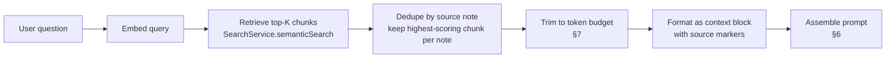

# 07. AI Architecture

> Part of the [Documentation Index](DOCUMENT_INDEX.md). Implements the AI request flow and embedding pipeline from [03_ARCHITECTURE.md §6.4–6.5](03_ARCHITECTURE.md#64-embedding-pipeline), and fills in the detail `AIService`/`EmbeddingService` deferred to this document in [05_API.md §8, §10](05_API.md#8-embeddingservice). Consumed by [08_SEARCH.md](08_SEARCH.md) (semantic search reads the embeddings this document produces) and referenced by [06_MCP.md §6](06_MCP.md#6-tools) (why chat isn't an MCP tool).

## 1. Purpose & Scope

This document specifies how Second Brain uses OpenAI ([03_ARCHITECTURE.md §2.1](03_ARCHITECTURE.md#21-technology-stack)) for two things: turning note content into embeddings, and turning a user's question plus retrieved context into a cited, streamed answer. Everything here satisfies FR-SEM-1–3 and FR-AI-1–5 ([02_PRD.md §4.11–4.12](02_PRD.md#411-semantic-search)) within the latency budgets in [02_PRD.md §6](02_PRD.md#6-non-functional-requirements).

## 2. Model Selection Strategy

The specific model identifier is a **configuration value, revisited periodically as providers ship new models** — not an architectural commitment this document hardcodes. What's fixed is the *tier* selected per use case and the reasoning behind each:

| Use case | Model tier | Rationale |
|---|---|---|
| Embeddings | Small/efficient embedding tier | Called on every note save; cost and latency scale with volume, not with any single request's importance. Fixed at 1536 dimensions to match `embeddings.embedding` ([04_DATABASE.md §4.9](04_DATABASE.md#49-embeddings)) — changing tiers within the same dimensionality is a config change; changing dimensionality requires a migration (§3). |
| Note chat (`scope: 'note'`) | Fast, cost-efficient chat tier | Context is a single note — small input, and the p95 first-token budget (< 1.5s, [02_PRD.md §6](02_PRD.md#6-non-functional-requirements)) rewards a fast model over a maximally capable one. |
| Vault chat (`scope: 'vault'`) | Same fast tier by default | Most questions are answerable from a handful of retrieved chunks; defaulting to the fast tier keeps cost and latency predictable. |
| Future: self-organizing suggestions ([01_PRODUCT.md §8](01_PRODUCT.md#8-self-organizing-knowledge)) | Higher-reasoning tier, run asynchronously | Not on the interactive request path, so the p95 latency budget doesn't apply — duplicate detection and canonicalization can afford a slower, more capable model. Not MVP. |

**No automatic escalation in MVP.** A harder vault-chat question gets the same fast-tier model as a simple one; there is no complexity-detection step that upgrades the model mid-request. This is a deliberate simplicity choice — model-tier routing is a legitimate future optimization, not a day-one requirement.

## 3. Embedding Strategy

| Question | Answer |
|---|---|
| What gets embedded | Markdown Notes only — the sole embeddable Knowledge Object type in MVP ([01_PRODUCT.md §2](01_PRODUCT.md#2-the-knowledge-object)). Attachments are not embedded in MVP (no text extraction pipeline exists yet — that's what OCR, a future connector, would provide). |
| When | Asynchronously, triggered by the Supabase Database Webhook on note insert/update ([03_ARCHITECTURE.md §6.4](03_ARCHITECTURE.md#64-embedding-pipeline)) — never synchronously on save (FR-SEM-3). |
| On delete | `EmbeddingService.deleteEmbeddings` removes all chunk rows for the object; soft-deleted notes' embeddings are excluded from semantic search results via the same `deleted_at` join used everywhere else ([04_DATABASE.md §6](04_DATABASE.md#6-soft-deletes)), not a separate flag. |
| On manual re-embed | `EmbeddingService.reembed` ([05_API.md §8](05_API.md#8-embeddingservice)) upserts on `(knowledge_object_id, chunk_index)` — safe to call repeatedly, e.g. after fixing a bad embed. |
| Freshness budget | p95 save-to-semantically-searchable under 60 seconds; alert if lag exceeds 5 minutes. This is the "specific target" [02_PRD.md §8](02_PRD.md#8-success-metrics) defers to this document. |
| On model change | Changing the embedding *model* within the same 1536-dimension tier is a rolling re-embed (`reembed` called per object, no schema change). Changing to a model with a **different dimensionality** requires a schema migration to `embeddings.embedding`'s vector width — flagged here explicitly since [04_DATABASE.md](04_DATABASE.md) does not version embeddings by model today; a `model_version` column is the anticipated addition if/when a dimension change is scheduled. |

## 4. Chunking

Chunking exists so a single long note doesn't collapse into one embedding vector that's too diffuse to match a specific question — and so it doesn't happen at all when it isn't needed.

| Rule | Value |
|---|---|
| Short notes | A note under ~500 tokens is embedded as a **single chunk** (`chunk_index = 0`) — most personal notes fall here; splitting them would add index rows for no retrieval benefit. |
| Long notes | Split on markdown structure first (headers, then paragraphs) so a chunk boundary never falls mid-sentence when avoidable. |
| Target chunk size | ~500 tokens |
| Overlap | ~75 tokens (~15%) between adjacent chunks, so a fact stated near a chunk boundary isn't lost to either chunk. |
| Minimum chunk size | Trailing fragments below a small floor are merged into the previous chunk rather than stored as their own near-empty row. |

Each resulting chunk becomes one `embeddings` row, with `chunk_text` stored alongside the vector ([04_DATABASE.md §4.9](04_DATABASE.md#49-embeddings)) specifically so retrieval doesn't need to re-fetch the source note just to know what a chunk says.

## 5. Context Assembly (RAG)

**Note-scope chat** (`scope: 'note'`): context is the entire note body, injected directly — no retrieval step, since the "corpus" is one already-known note. If the note is long enough to itself need chunking, that's a token-budget concern (§7), not a retrieval one.

**Vault-scope chat** (`scope: 'vault'`): context comes from `SearchService.semanticSearch` ([05_API.md §6](05_API.md#6-searchservice)), retrieving more candidates than will ultimately be used (over-fetch, e.g. top 20), then deduplicating to one chunk per source note (a single note shouldn't crowd out other relevant notes from the answer) before token-budget trimming.

## 6. Prompt Templates

Every chat request assembles a prompt from four fixed parts, in this order:

| Part | Content | Notes |
|---|---|---|
| 1. System | Assistant behavior instructions, including an explicit citation requirement | Placed first and kept stable across requests to benefit from provider-side prompt caching (§9). |
| 2. Context | The note body (note-scope) or retrieved chunks (vault-scope), each tagged with its source `knowledgeObjectId` and title | The model is instructed to cite using these ids — this is what makes `AIService.streamChat`'s `citation` stream events (FR-AI-3, [05_API.md §10](05_API.md#10-aiservice)) possible; citations are extracted from the model's structured output, not inferred after the fact. |
| 3. History | The conversation's prior turns, most recent last | Trimmed under budget pressure before context is (§7) — a user re-asking a slightly different question cares more about accurate current context than about the model remembering turn three. |
| 4. Question | The user's current message | Always included in full; never trimmed. |

**Citation requirement is non-negotiable in the system prompt**: every factual claim traceable to a note must reference that note's id. This is the prompt-level enforcement mechanism behind FR-AI-3, working together with the fact that `AIService` structurally has no method to write outside chat history (§10, [05_API.md §10](05_API.md#10-aiservice)).

## 7. Token Budgeting

Second Brain budgets an internal token allowance independent of the underlying model's true context window, so the budget doesn't silently change when the configured model (§2) changes:

| Part | Budget | On overflow |
|---|---|---|
| System prompt | ~300 tokens | Never trimmed. |
| Context (notes/chunks) | Up to ~4,000 tokens | Lowest-scoring chunks/notes dropped first. |
| Conversation history | Up to ~2,000 tokens | Oldest turns dropped first, in whole-message units (never a truncated mid-message). |
| Question | Whatever it takes | Never trimmed. |
| Reserved for response | ~1,500 tokens | Not part of the input budget — reserved so the model has room to answer and cite without hitting an output limit mid-sentence. |

This adds up to roughly an 8,000-token request budget — generous for personal-note-scale context, deliberately conservative to keep latency and cost predictable regardless of which model tier (§2) is configured.

## 8. Streaming

Chat responses stream over Server-Sent Events from a Vercel Route Handler ([03_ARCHITECTURE.md §11](03_ARCHITECTURE.md#11-architecture-decision-records), ADR-6), emitting the `ChatStreamEvent` union defined in [05_API.md §10](05_API.md#10-aiservice): `token` events as they arrive from the model, `citation` events as references are identified, and one terminal `done` event carrying the persisted `messageId`.

**Mid-stream failure:** if the upstream call fails after streaming has started, the server emits a terminal error event rather than silently closing the connection, and persists whatever partial `ChatMessage` content was streamed so far rather than discarding it — a user shouldn't lose a mostly-good answer because the last few tokens failed.

## 9. Caching

| What | Cached? | How |
|---|---|---|
| Embeddings | Yes — this *is* the cache | Computed once per note save, reused by every future search and chat until the note changes. This is the dominant cost/latency win in the whole AI architecture: without it, every search would require live embedding calls. |
| Prompt prefixes (system instructions, stable context ordering) | Indirectly, via the provider | Keeping the system prompt (§6, part 1) identical and first across requests lets OpenAI's own prompt caching reduce latency/cost on repeated structure — no caching logic is built or maintained on Second Brain's side for this. |
| Chat responses | No | Each answer reflects the graph's state *at the time of asking*; caching a previous answer risks serving stale information after the user has since edited the relevant notes. |
| Search results | No | Cheap enough to recompute (§9 latency budgets in [08_SEARCH.md](08_SEARCH.md)) and must reflect the latest graph state for the same staleness reason. |

## 10. Rate Limits

| Surface | Approach |
|---|---|
| Interactive chat (`AIService.streamChat`) | Per-user rate limit (token-bucket), enforced before the OpenAI call — protects against both cost blowout and a single user starving shared capacity. Exact thresholds are [09_SECURITY.md](09_SECURITY.md)'s to set. |
| Embedding pipeline | Not user-rate-limited directly (it's triggered by saves, not a user action a user consciously repeats), but the embedding endpoint enforces a concurrency cap so a bulk import or rapid-fire edit burst can't fan out into an unbounded number of simultaneous OpenAI calls. |
| MCP tool calls | Inherit the same per-user limit as the web app ([06_MCP.md §9](06_MCP.md#9-security-considerations)) — an MCP client is a normal caller, not an exempted first-party surface. |
| `RateLimitError` | The shared error thrown when any of the above trips ([05_API.md §3](05_API.md#3-error-taxonomy)), mapped to HTTP 429 / an MCP rate-limit tool error. |

## 11. Summaries

There is no persisted "summary" artifact or database column in MVP. Summarization is an **emergent capability of note-level chat** (FR-AI-1): a user asks "summarize this note," `AIService.streamChat` answers using the note's own body as context (§5), and the exchange is stored only as ordinary `chat_messages` rows — nothing is written back to the note itself (consistent with FR-AI-5's no-autonomous-writes constraint).

**Future consideration, not MVP:** a persisted auto-summary (e.g., for graph-node tooltips or richer search snippets) would need a new nullable column on `notes` and a background-job pattern mirroring the embedding pipeline (§3, [03_ARCHITECTURE.md §6.4](03_ARCHITECTURE.md#64-embedding-pipeline)) — the same webhook-triggered shape, a different downstream action.

## 12. RAG Summary

Retrieval always precedes generation, never the reverse, and retrieval is always `SearchService`'s job, never `AIService`'s own: `AIService` calls `SearchService.semanticSearch` (§5, [05_API.md §12](05_API.md#12-cross-service-interaction-rules), rule 1) rather than querying `embeddings` directly, so ranking logic has exactly one implementation, shared between chat and the search UI. Ranking detail — how full-text and semantic results combine — is [08_SEARCH.md](08_SEARCH.md)'s responsibility, not this document's.

## 13. Related Documents

- [03_ARCHITECTURE.md §6.4–6.5](03_ARCHITECTURE.md#64-embedding-pipeline) — the async pipeline and streaming transport this document specifies the content of.
- [04_DATABASE.md §4.9](04_DATABASE.md#49-embeddings) — the `embeddings` table this document's chunking strategy populates.
- [05_API.md §8, §10](05_API.md#8-embeddingservice) — `EmbeddingService` and `AIService` method contracts this document fills in.
- [06_MCP.md §6](06_MCP.md#6-tools) — why chat is not exposed as an MCP tool, and the prompt-injection consideration for content returned through MCP.
- [08_SEARCH.md](08_SEARCH.md) — the ranking algorithm that consumes the embeddings this document produces.
- [09_SECURITY.md](09_SECURITY.md) — concrete rate-limit thresholds referenced in §10.
